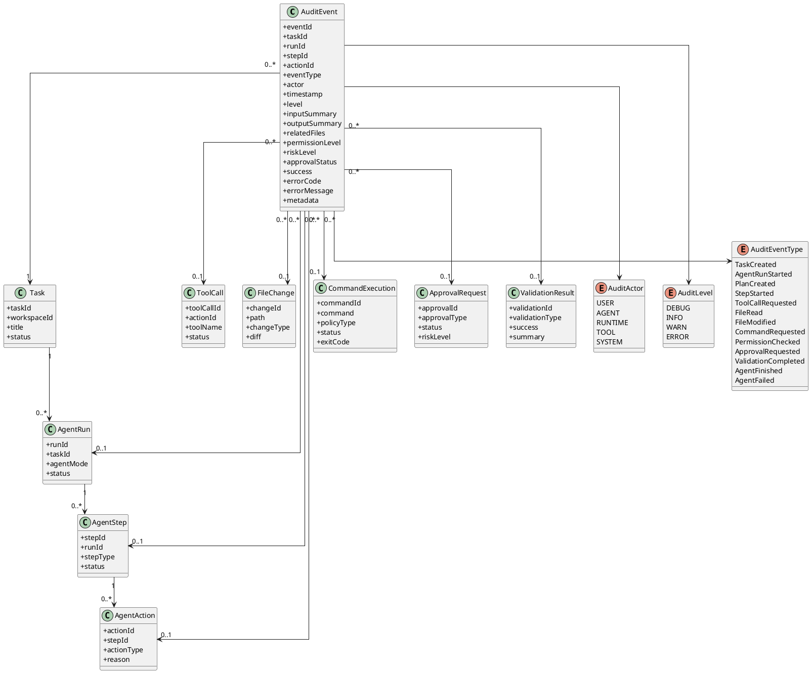
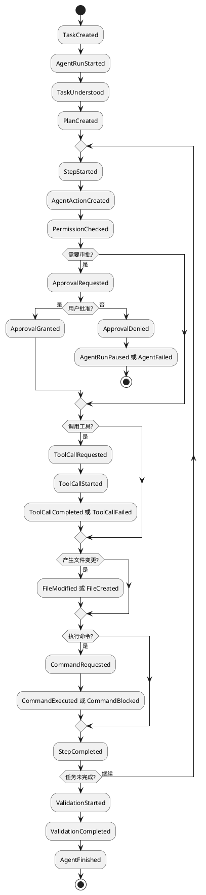

# 审计日志草案

## 1. 文档目标

本文档描述可审计编码智能体第一版的审计日志模型。

审计日志的目标不是简单记录运行日志，而是让系统能够回答：

- 用户提出了什么任务？
- Agent 如何理解任务？
- Agent 制定了什么计划？
- Agent 读取了哪些文件？
- Agent 为什么修改这些文件？
- Agent 实际改了哪些内容？
- Agent 申请执行了哪些命令？
- 哪些操作经过了用户审批？
- 哪些操作被拒绝或阻止？
- 验证是否执行？
- 任务最终是否成功？

审计日志是后续任务回放、执行可视化、文件变更追踪、审批历史和问题诊断的基础。

## 2. 核心原则

### 2.1 追加写入

审计日志应采用追加写入模型。

已经发生的事件不应被覆盖或随意修改。状态可以更新，但事件应该保留历史事实。

### 2.2 结构化记录

审计日志不应该只是文本日志，而应是结构化事件。

每条事件至少应包含：

```text
事件类型
所属任务
所属运行实例
所属步骤
发生时间
执行主体
输入摘要
输出摘要
权限等级
风险等级
审批状态
错误信息
元数据
```

### 2.3 可追溯

每条关键事件都应能追溯到：

```text
Task
AgentRun
AgentStep
AgentAction
ToolCall
ApprovalRequest
FileChange
CommandExecution
```

### 2.4 摘要优先

第一版不强制保存完整 LLM Prompt、完整命令输出或完整文件内容。

建议优先保存摘要，并对敏感信息做脱敏处理。

### 2.5 敏感信息保护

审计日志不能成为新的敏感信息泄漏点。

以下内容应默认脱敏或避免完整保存：

```text
API Key
Token
密码
私钥
.env 文件内容
凭证文件内容
完整命令输出中的敏感片段
完整 LLM Prompt 中的敏感片段
```

## 3. 审计事件总览

第一版建议将事件分为以下类型：

```text
任务事件
运行事件
计划事件
步骤事件
模型事件
工具事件
文件事件
命令事件
权限事件
审批事件
验证事件
错误事件
完成事件
```

事件流示例：

```text
TaskCreated
AgentRunStarted
TaskUnderstood
PlanCreated
StepStarted
ToolCallRequested
FileRead
ToolCallCompleted
FilePatchProposed
PermissionChecked
FilePatched
ApprovalRequested
ApprovalGranted
CommandExecuted
ValidationCompleted
AgentFinished
```

## 4. AuditEvent 基础结构

建议第一版统一使用 `AuditEvent` 作为审计事件基础模型。

```text
AuditEvent
- eventId
- taskId
- runId
- stepId
- actionId
- eventType
- actor
- timestamp
- level
- inputSummary
- outputSummary
- relatedFiles
- relatedToolCallId
- relatedApprovalId
- relatedCommandId
- relatedFileChangeId
- permissionLevel
- riskLevel
- approvalStatus
- success
- errorCode
- errorMessage
- metadata
```

字段说明：

```text
eventId：事件唯一标识
taskId：所属任务
runId：所属 AgentRun
stepId：所属 AgentStep，可为空
actionId：所属 AgentAction，可为空
eventType：事件类型
actor：事件发起者，如 USER、AGENT、RUNTIME、TOOL、SYSTEM
timestamp：事件发生时间
level：事件级别，如 INFO、WARN、ERROR
inputSummary：输入摘要
outputSummary：输出摘要
relatedFiles：相关文件路径
relatedToolCallId：关联工具调用
relatedApprovalId：关联审批请求
relatedCommandId：关联命令执行
relatedFileChangeId：关联文件变更
permissionLevel：权限等级
riskLevel：风险等级
approvalStatus：审批状态
success：是否成功
errorCode：错误码
errorMessage：错误摘要
metadata：扩展信息
```

## 5. Actor 类型

建议定义事件主体：

```text
USER
AGENT
RUNTIME
TOOL
SYSTEM
```

说明：

- `USER`：用户主动创建任务、审批、拒绝、取消
- `AGENT`：模型产生计划、动作、解释和总结
- `RUNTIME`：运行时做权限判断、状态流转、事件记录
- `TOOL`：工具返回结果
- `SYSTEM`：系统初始化、配置加载、异常终止

## 6. Event Level

建议定义事件级别：

```text
DEBUG
INFO
WARN
ERROR
```

第一版默认记录 `INFO`、`WARN`、`ERROR`。

`DEBUG` 可用于开发阶段，但不建议默认写入长期审计日志。

## 7. 任务事件

### 7.1 TaskCreated

用户创建任务。

建议记录：

```text
taskId
workspaceId
userRequest summary
createdBy
```

### 7.2 TaskCancelled

用户或系统取消任务。

建议记录：

```text
taskId
runId
reason
cancelledBy
```

## 8. 运行事件

### 8.1 AgentRunStarted

AgentRun 开始执行。

建议记录：

```text
runId
taskId
agentMode
workspaceId
```

### 8.2 AgentRunPaused

AgentRun 暂停。

典型原因：

```text
等待审批
等待用户输入
达到速率限制
```

### 8.3 AgentRunResumed

AgentRun 从暂停中恢复。

### 8.4 AgentRunFailed

AgentRun 失败。

建议记录：

```text
failureReason
lastStepId
recoverable
```

## 9. 计划事件

### 9.1 PlanCreated

Agent 创建计划。

建议记录：

```text
planId
planItems summary
```

### 9.2 PlanUpdated

Agent 修改计划。

建议记录：

```text
planId
changedItems
reason
```

### 9.3 PlanItemStarted

某个计划项开始执行。

### 9.4 PlanItemCompleted

某个计划项完成。

### 9.5 PlanItemFailed

某个计划项失败。

## 10. 步骤事件

### 10.1 StepStarted

AgentStep 开始。

建议记录：

```text
stepId
stepType
planItemId
inputSummary
```

### 10.2 StepCompleted

AgentStep 完成。

建议记录：

```text
stepId
stepType
outputSummary
duration
```

### 10.3 StepFailed

AgentStep 失败。

建议记录：

```text
stepId
stepType
errorCode
errorMessage
recoverable
```

## 11. 模型事件

### 11.1 ModelCallStarted

LLM 调用开始。

建议记录：

```text
model
purpose
promptVersion
inputContextSummary
```

### 11.2 ModelCallCompleted

LLM 调用完成。

建议记录：

```text
model
outputSummary
tokenUsage
duration
decisionType
```

### 11.3 ModelCallFailed

LLM 调用失败。

建议记录：

```text
model
errorCode
errorMessage
retryable
```

注意：第一版不建议默认保存完整 prompt 和完整模型输出。可以保存摘要、版本号和关键结构化结果。

## 12. 工具事件

### 12.1 ToolCallRequested

Agent 请求调用工具。

建议记录：

```text
toolCallId
toolName
inputSummary
permissionLevel
reason
```

### 12.2 ToolCallStarted

工具调用开始。

### 12.3 ToolCallCompleted

工具调用成功。

建议记录：

```text
toolCallId
toolName
outputSummary
duration
```

### 12.4 ToolCallFailed

工具调用失败。

建议记录：

```text
toolCallId
toolName
errorCode
errorMessage
retryable
```

## 13. 文件事件

### 13.1 FileRead

文件被读取。

建议记录：

```text
path
readReason
contentSummary
```

不建议完整记录文件内容。

### 13.2 FileCreated

文件被创建。

建议记录：

```text
path
reason
contentSummary
fileChangeId
```

### 13.3 FileModified

文件被修改。

建议记录：

```text
path
reason
diffSummary
fileChangeId
```

完整 diff 可以存放在 `FileChange` 中，审计事件只记录摘要和关联 ID。

### 13.4 FileDeleted

文件被删除。

建议记录：

```text
path
reason
approvalId
fileChangeId
```

删除文件必须审批。

### 13.5 FileMoved

文件被移动或重命名。

建议记录：

```text
sourcePath
targetPath
reason
approvalId
fileChangeId
```

移动文件必须审批。

### 13.6 FileAccessBlocked

文件访问被阻止。

常见原因：

```text
workspace 外路径
命中阻止路径
路径穿越
敏感文件未审批
```

## 14. 命令事件

### 14.1 CommandRequested

Agent 请求执行命令。

建议记录：

```text
commandId
command
workingDirectory
reason
policyType
riskLevel
```

### 14.2 CommandAllowed

命令命中白名单，被允许执行。

### 14.3 CommandApprovalRequired

命令未命中白名单，需要审批。

### 14.4 CommandBlocked

命令被阻止。

建议记录：

```text
command
blockedReason
matchedRule
```

### 14.5 CommandExecuted

命令执行完成。

建议记录：

```text
commandId
exitCode
outputSummary
duration
```

不建议默认保存完整 stdout/stderr，尤其是可能包含敏感信息时。

## 15. 权限事件

### 15.1 PermissionChecked

Runtime 对 AgentAction 进行权限判断。

建议记录：

```text
actionId
permissionLevel
riskLevel
matchedPolicy
decision
```

### 15.2 PermissionAllowed

动作被允许。

### 15.3 PermissionApprovalRequired

动作需要审批。

### 15.4 PermissionBlocked

动作被阻止。

建议记录：

```text
actionId
blockedReason
riskLevel
matchedPolicy
```

## 16. 审批事件

### 16.1 ApprovalRequested

Runtime 创建审批请求。

建议记录：

```text
approvalId
approvalType
reason
riskLevel
affectedFiles
command
patchPreviewSummary
```

### 16.2 ApprovalGranted

用户批准操作。

建议记录：

```text
approvalId
approvedBy
approvalScope
```

approvalScope 可以是：

```text
本次操作
本任务内同类操作
加入白名单
```

### 16.3 ApprovalDenied

用户拒绝操作。

建议记录：

```text
approvalId
deniedBy
reason
```

### 16.4 ApprovalExpired

审批超时。

## 17. 验证事件

### 17.1 ValidationStarted

验证开始。

建议记录：

```text
validationId
validationType
commandId
```

### 17.2 ValidationCompleted

验证完成。

建议记录：

```text
validationId
success
summary
```

### 17.3 ValidationFailed

验证失败。

建议记录：

```text
validationId
failureSummary
relatedFiles
```

## 18. 完成事件

### 18.1 AgentFinished

Agent 成功完成任务。

建议记录：

```text
taskId
runId
summary
changedFiles
validationSummary
```

### 18.2 AgentFailed

Agent 无法完成任务。

建议记录：

```text
taskId
runId
failureReason
lastError
recoverable
```

## 19. 审计日志示例

示例事件：

```json
{
  "eventId": "evt_001",
  "taskId": "task_001",
  "runId": "run_001",
  "stepId": "step_003",
  "actionId": "action_002",
  "eventType": "FileModified",
  "actor": "RUNTIME",
  "timestamp": "2026-04-29T22:00:00+08:00",
  "level": "INFO",
  "inputSummary": "Apply patch to UserService.java",
  "outputSummary": "Modified one method and added null check",
  "relatedFiles": [
    "src/main/java/com/example/UserService.java"
  ],
  "relatedFileChangeId": "change_001",
  "permissionLevel": "WORKSPACE_WRITE",
  "riskLevel": "LOW",
  "approvalStatus": "NOT_REQUIRED",
  "success": true,
  "metadata": {
    "planItemId": "item_002"
  }
}
```

## 20. 审计存储建议

第一版可以采用本地持久化，后续再扩展数据库。

建议逻辑结构：

```text
.agent/
  tasks/
    task_001/
      task.json
      runs/
        run_001/
          events.jsonl
          state.json
          plan.json
          file-changes.json
          approvals.json
          report.md
```

`events.jsonl` 适合追加写入，每行一条 JSON 事件。

优点：

- 简单
- 可读
- 易调试
- 容易回放
- 后续可迁移到数据库

## 21. PlantUML 类图



## 22. PlantUML 事件流示例



## 23. 第一版落地范围

第一版建议优先实现以下事件：

```text
TaskCreated
AgentRunStarted
TaskUnderstood
PlanCreated
PlanUpdated
StepStarted
StepCompleted
ToolCallRequested
ToolCallCompleted
ToolCallFailed
FileRead
FileCreated
FileModified
FileAccessBlocked
CommandRequested
CommandExecuted
CommandBlocked
PermissionChecked
PermissionAllowed
PermissionApprovalRequired
PermissionBlocked
ApprovalRequested
ApprovalGranted
ApprovalDenied
ValidationStarted
ValidationCompleted
AgentFinished
AgentFailed
```

暂时可以不做：

```text
完整 prompt 归档
完整 stdout/stderr 长期保存
复杂事件检索
团队级审计报表
事件签名防篡改
远程审计同步
```

## 24. 第一版验收标准

审计日志第一版完成后，应满足：

- 创建任务会产生审计事件
- AgentRun 开始和结束会产生审计事件
- 每个 AgentStep 都有开始和结束事件
- 每次工具调用都有请求和结果事件
- 每次文件读取、创建、修改都有审计事件
- 文件删除、移动审批结果有审计事件
- 每次命令申请、执行、阻止都有审计事件
- 每次权限判断都有审计事件
- 每次审批请求和审批结果都有审计事件
- 任务结束后可以基于事件生成执行报告
- 事件日志可以按时间顺序回放一次任务执行过程
