# 核心领域模型草案

## 1. 文档目标

本文档描述可审计编码智能体第一版的核心领域模型。该模型服务于以下目标：

- 支撑本地 Java 后端 Agent Service
- 支撑任务执行、工具调用、权限审批和审计日志
- 支撑 trusted workspace 内的文件读取、创建和修改
- 支撑命令白名单和命令审批
- 支撑后续 CLI、Web、桌面应用等客户端接入

本文档仍属于阶段 0 的概念草案，不涉及具体数据库表结构和代码实现。

## 2. 核心模型总览

第一版建议围绕以下核心对象设计：

```text
Workspace
Task
AgentRun
AgentState
Plan
PlanItem
AgentStep
AgentAction
ToolCall
ToolResult
FileChange
CommandExecution
ApprovalRequest
AuditEvent
ValidationResult
MemoryEntry
```

其中最核心的主线是：

```text
Workspace
→ Task
→ AgentRun
→ AgentStep
→ AgentAction
→ ToolCall / FileChange / CommandExecution / ApprovalRequest
→ AuditEvent
```

可以理解为：

- `Workspace` 定义 Agent 能操作的安全边界
- `Task` 表示用户提出的一次目标
- `AgentRun` 表示一次任务执行过程
- `AgentState` 保存执行中的当前状态
- `Plan` 和 `PlanItem` 表示任务计划
- `AgentStep` 表示 Agent 的一次执行循环
- `AgentAction` 表示 Agent 在某一步决定要做什么
- `ToolCall` 表示对工具的调用
- `FileChange` 表示文件变更
- `CommandExecution` 表示命令执行
- `ApprovalRequest` 表示需要用户审批的动作
- `AuditEvent` 表示所有关键行为的事件记录
- `ValidationResult` 表示验证结果
- `MemoryEntry` 表示后续可沉淀的项目记忆或经验记忆

## 3. 核心对象说明

### 3.1 Workspace

`Workspace` 是 Agent 的文件访问边界。

第一版中，Agent 只能操作用户显式信任的 Workspace。

建议字段：

```text
workspaceId
name
rootPath
trusted
allowedOperations
createdAt
lastUsedAt
```

关键规则：

- Agent 默认不能访问 workspace 外路径
- Agent 默认不能修改 `.git` 目录
- Agent 默认不能读取或修改敏感文件，除非用户额外审批
- 所有文件操作必须绑定到某个 Workspace

### 3.2 Task

`Task` 表示用户提交的一次编码目标。

建议字段：

```text
taskId
workspaceId
title
userRequest
status
createdAt
updatedAt
```

典型状态：

```text
CREATED
RUNNING
WAITING_APPROVAL
WAITING_USER_INPUT
COMPLETED
FAILED
CANCELLED
```

### 3.3 AgentRun

`AgentRun` 表示一次任务执行实例。

一个 Task 可以有多次 AgentRun，例如失败后重新执行、用户调整后再次执行。

建议字段：

```text
runId
taskId
agentMode
status
startedAt
finishedAt
failureReason
```

`agentMode` 第一版可以包括：

```text
PLANNING
CODE_EDIT
REVIEW
DEBUG
TEST
```

### 3.4 AgentState

`AgentState` 表示 AgentRun 当前的结构化状态。

建议包含：

```text
runId
currentStepId
currentPlanItemId
messages
observations
toolResults
fileChanges
validationResults
approvalRecords
errors
runtimeMetadata
```

注意：`AgentState` 是运行时状态，不等同于审计日志。审计日志用于追踪历史事实，AgentState 用于指导下一步决策。

### 3.5 Plan 和 PlanItem

`Plan` 表示 Agent 对任务的执行计划。

`PlanItem` 表示计划中的一个可执行小步骤。

建议字段：

```text
Plan
- planId
- taskId
- runId
- status
- createdAt
- updatedAt

PlanItem
- itemId
- planId
- description
- status
- relatedFiles
- notes
- orderIndex
```

PlanItem 状态：

```text
PENDING
IN_PROGRESS
COMPLETED
FAILED
SKIPPED
```

### 3.6 AgentStep

`AgentStep` 表示 Agent Loop 中的一次执行步骤。

建议字段：

```text
stepId
runId
planItemId
stepType
inputSummary
outputSummary
status
startedAt
finishedAt
```

典型 stepType：

```text
UNDERSTAND_TASK
INSPECT_WORKSPACE
CREATE_PLAN
EXECUTE_PLAN_ITEM
OBSERVE_RESULT
VALIDATE
FINISH
FAIL
```

### 3.7 AgentAction

`AgentAction` 表示 Agent 在某个 Step 中做出的下一步动作决策。

建议字段：

```text
actionId
stepId
actionType
reason
riskLevel
status
createdAt
```

典型 actionType：

```text
CALL_MODEL
CALL_TOOL
REQUEST_APPROVAL
ASK_USER
UPDATE_PLAN
RUN_VALIDATION
FINISH
FAIL
```

### 3.8 ToolCall 和 ToolResult

`ToolCall` 表示一次工具调用请求。

`ToolResult` 表示工具调用结果。

建议字段：

```text
ToolCall
- toolCallId
- actionId
- toolName
- permissionLevel
- inputSummary
- status
- startedAt
- finishedAt

ToolResult
- resultId
- toolCallId
- success
- outputSummary
- errorMessage
- metadata
```

第一版工具可以包括：

```text
list_files
read_file
search_text
apply_patch
run_command
git_status
git_diff
```

### 3.9 FileChange

`FileChange` 表示 Agent 对文件产生的变更。

建议字段：

```text
changeId
workspaceId
taskId
runId
stepId
path
changeType
reason
diff
riskLevel
approvalId
createdAt
```

changeType：

```text
CREATE
MODIFY
DELETE
MOVE
```

第一版默认允许：

- 创建文件
- 修改文件

第一版默认需要审批：

- 删除文件
- 移动文件
- 修改敏感文件
- 大范围修改

### 3.10 CommandExecution

`CommandExecution` 表示一次命令执行申请或执行记录。

建议字段：

```text
commandId
workspaceId
taskId
runId
stepId
command
workingDirectory
policyType
riskLevel
approvalId
status
exitCode
outputSummary
startedAt
finishedAt
```

policyType：

```text
ALLOWLIST
APPROVAL_REQUIRED
BLOCKED
```

第一版默认不自动执行命令，白名单外命令必须审批。

### 3.11 ApprovalRequest

`ApprovalRequest` 表示需要用户确认的高风险动作。

建议字段：

```text
approvalId
taskId
runId
stepId
actionId
approvalType
reason
riskLevel
affectedFiles
command
patchPreview
status
createdAt
resolvedAt
```

approvalType：

```text
FILE_DELETE
FILE_MOVE
SENSITIVE_FILE_MODIFY
LARGE_PATCH
COMMAND_EXECUTION
NETWORK_ACCESS
GIT_WRITE
DEPENDENCY_INSTALL
```

status：

```text
PENDING
APPROVED
DENIED
EXPIRED
CANCELLED
```

### 3.12 AuditEvent

`AuditEvent` 是可审计能力的基础。

所有关键行为都应该记录为事件。

建议字段：

```text
eventId
taskId
runId
stepId
eventType
actor
timestamp
inputSummary
outputSummary
relatedFiles
permissionLevel
approvalStatus
errorMessage
metadata
```

典型 eventType：

```text
TaskCreated
AgentRunStarted
PlanCreated
PlanUpdated
StepStarted
StepCompleted
ToolCallRequested
ToolCallCompleted
FileRead
FilePatched
CommandRequested
CommandExecuted
ApprovalRequested
ApprovalGranted
ApprovalDenied
ValidationStarted
ValidationCompleted
AgentFinished
AgentFailed
```

### 3.13 ValidationResult

`ValidationResult` 表示一次验证结果，例如测试、构建、lint。

建议字段：

```text
validationId
taskId
runId
stepId
commandId
validationType
success
summary
createdAt
```

validationType：

```text
TEST
BUILD
LINT
TYPE_CHECK
CUSTOM
```

### 3.14 MemoryEntry

`MemoryEntry` 表示后续可沉淀的项目记忆或经验记忆。

第一版可以只定义概念，不急于实现复杂 RAG。

建议字段：

```text
memoryId
workspaceId
sourceTaskId
memoryType
content
tags
approved
createdAt
```

memoryType：

```text
PROJECT
EXPERIENCE
USER_PREFERENCE
COMMAND_HINT
CODE_CONVENTION
```

长期记忆写入建议需要用户审批。

## 4. PlantUML 类图

```plantuml
@startuml
skinparam classAttributeIconSize 0
skinparam linetype ortho

class Workspace {
  +workspaceId
  +name
  +rootPath
  +trusted
  +allowedOperations
  +createdAt
  +lastUsedAt
}

class Task {
  +taskId
  +workspaceId
  +title
  +userRequest
  +status
  +createdAt
  +updatedAt
}

class AgentRun {
  +runId
  +taskId
  +agentMode
  +status
  +startedAt
  +finishedAt
  +failureReason
}

class AgentState {
  +runId
  +currentStepId
  +currentPlanItemId
  +messages
  +observations
  +runtimeMetadata
}

class Plan {
  +planId
  +taskId
  +runId
  +status
  +createdAt
  +updatedAt
}

class PlanItem {
  +itemId
  +planId
  +description
  +status
  +relatedFiles
  +notes
  +orderIndex
}

class AgentStep {
  +stepId
  +runId
  +planItemId
  +stepType
  +inputSummary
  +outputSummary
  +status
  +startedAt
  +finishedAt
}

class AgentAction {
  +actionId
  +stepId
  +actionType
  +reason
  +riskLevel
  +status
  +createdAt
}

class ToolCall {
  +toolCallId
  +actionId
  +toolName
  +permissionLevel
  +inputSummary
  +status
  +startedAt
  +finishedAt
}

class ToolResult {
  +resultId
  +toolCallId
  +success
  +outputSummary
  +errorMessage
  +metadata
}

class FileChange {
  +changeId
  +workspaceId
  +taskId
  +runId
  +stepId
  +path
  +changeType
  +reason
  +diff
  +riskLevel
  +approvalId
  +createdAt
}

class CommandExecution {
  +commandId
  +workspaceId
  +taskId
  +runId
  +stepId
  +command
  +workingDirectory
  +policyType
  +riskLevel
  +approvalId
  +status
  +exitCode
  +outputSummary
  +startedAt
  +finishedAt
}

class ApprovalRequest {
  +approvalId
  +taskId
  +runId
  +stepId
  +actionId
  +approvalType
  +reason
  +riskLevel
  +affectedFiles
  +command
  +patchPreview
  +status
  +createdAt
  +resolvedAt
}

class AuditEvent {
  +eventId
  +taskId
  +runId
  +stepId
  +eventType
  +actor
  +timestamp
  +inputSummary
  +outputSummary
  +relatedFiles
  +permissionLevel
  +approvalStatus
  +errorMessage
  +metadata
}

class ValidationResult {
  +validationId
  +taskId
  +runId
  +stepId
  +commandId
  +validationType
  +success
  +summary
  +createdAt
}

class MemoryEntry {
  +memoryId
  +workspaceId
  +sourceTaskId
  +memoryType
  +content
  +tags
  +approved
  +createdAt
}

Workspace "1" --> "0..*" Task
Workspace "1" --> "0..*" FileChange
Workspace "1" --> "0..*" CommandExecution
Workspace "1" --> "0..*" MemoryEntry

Task "1" --> "0..*" AgentRun
Task "1" --> "0..*" Plan
Task "1" --> "0..*" AuditEvent
Task "1" --> "0..*" ApprovalRequest
Task "1" --> "0..*" FileChange
Task "1" --> "0..*" CommandExecution
Task "1" --> "0..*" ValidationResult

AgentRun "1" --> "1" AgentState
AgentRun "1" --> "0..*" AgentStep
AgentRun "1" --> "0..1" Plan
AgentRun "1" --> "0..*" AuditEvent

Plan "1" --> "1..*" PlanItem
PlanItem "0..1" --> "0..*" AgentStep

AgentStep "1" --> "0..*" AgentAction
AgentStep "1" --> "0..*" AuditEvent
AgentStep "1" --> "0..*" FileChange
AgentStep "1" --> "0..*" CommandExecution
AgentStep "1" --> "0..*" ValidationResult

AgentAction "1" --> "0..1" ToolCall
AgentAction "1" --> "0..1" ApprovalRequest

ToolCall "1" --> "0..1" ToolResult

ApprovalRequest "0..1" --> "0..*" FileChange
ApprovalRequest "0..1" --> "0..*" CommandExecution

CommandExecution "0..1" --> "0..1" ValidationResult

MemoryEntry "0..*" --> "0..1" Task : source

@enduml
```



## 5. 关键关系说明

### 5.1 Workspace 是安全边界

`Workspace` 是所有文件操作和命令执行的根边界。

任何文件路径都必须能解析到某个 trusted workspace 内，否则应直接拒绝或进入审批流程。

### 5.2 Task 和 AgentRun 分离

`Task` 表示用户目标，`AgentRun` 表示一次具体执行。

这样设计可以支持：

- 同一个任务失败后重新执行
- 用户调整要求后再次执行
- 同一任务未来由不同 Agent 模式执行
- 保留每次执行的完整审计轨迹

### 5.3 AgentState 和 AuditEvent 分离

`AgentState` 服务于运行时决策，表示当前状态。

`AuditEvent` 服务于审计，表示已经发生的事实。

二者不能混用：

- State 可以被更新
- Event 应该追加写入
- Event 不应该被随意修改

### 5.4 AgentStep 和 AgentAction 分离

`AgentStep` 表示一次执行循环。

`AgentAction` 表示这次循环中 Agent 决定做的动作。

这样可以支持一个 Step 中产生不同类型动作：

- 调用模型
- 调用工具
- 申请审批
- 更新计划
- 结束任务

### 5.5 文件变更必须可追踪

`FileChange` 应该记录：

- 变更路径
- 变更类型
- 变更原因
- diff
- 关联 step
- 关联 approval
- 风险等级

这样才能在任务结束后回答“为什么改了这个文件”和“是哪一步改的”。

### 5.6 命令执行必须经过策略判断

`CommandExecution` 应该先经过命令策略判断：

```text
ALLOWLIST
APPROVAL_REQUIRED
BLOCKED
```

命令是否实际执行，不应该由 LLM 直接决定，而应由 Runtime 根据策略控制。

### 5.7 审批是 Runtime 的控制点

`ApprovalRequest` 是 Runtime 暂停执行并等待用户决策的控制点。

需要审批的行为包括：

- 删除文件
- 移动文件
- 修改敏感文件
- 大范围修改
- 执行未加入白名单的命令
- Git 写操作
- 网络访问
- 安装依赖

### 5.8 审计事件是后续可视化和回放基础

所有关键行为都应写入 `AuditEvent`。

后续执行时间线、任务回放、审批历史、文件变更视图，都可以基于事件流构建。

## 6. 第一版建议优先实现的最小模型

为了避免一开始模型过重，第一版可以优先实现：

```text
Workspace
Task
AgentRun
AgentState
Plan
PlanItem
AgentStep
ToolCall
ToolResult
FileChange
CommandExecution
ApprovalRequest
AuditEvent
ValidationResult
```

`MemoryEntry` 可以先保留概念，等项目记忆阶段再落地。

## 7. 后续扩展方向

后续可以继续扩展：

- WorkflowDefinition
- WorkflowNode
- WorkflowEdge
- AgentProfile
- ToolDefinition
- ToolPermission
- CommandPolicy
- ProjectProfile
- CodeSymbol
- CodeReference
- MemoryCollection
- AuditReport

这些对象更适合在状态机、工作流内核、项目记忆和可视化回放阶段引入。
