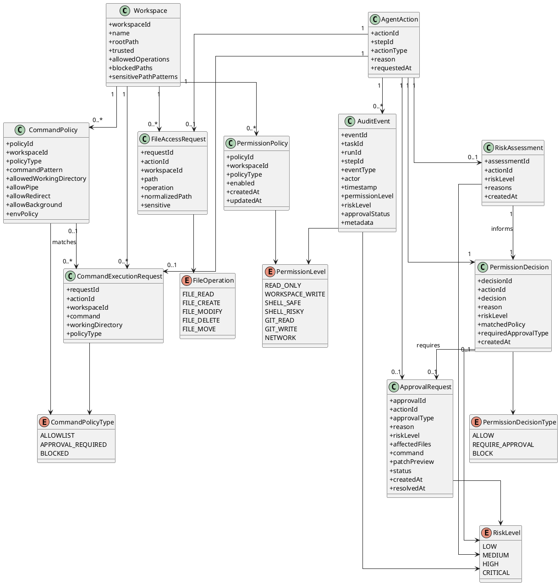
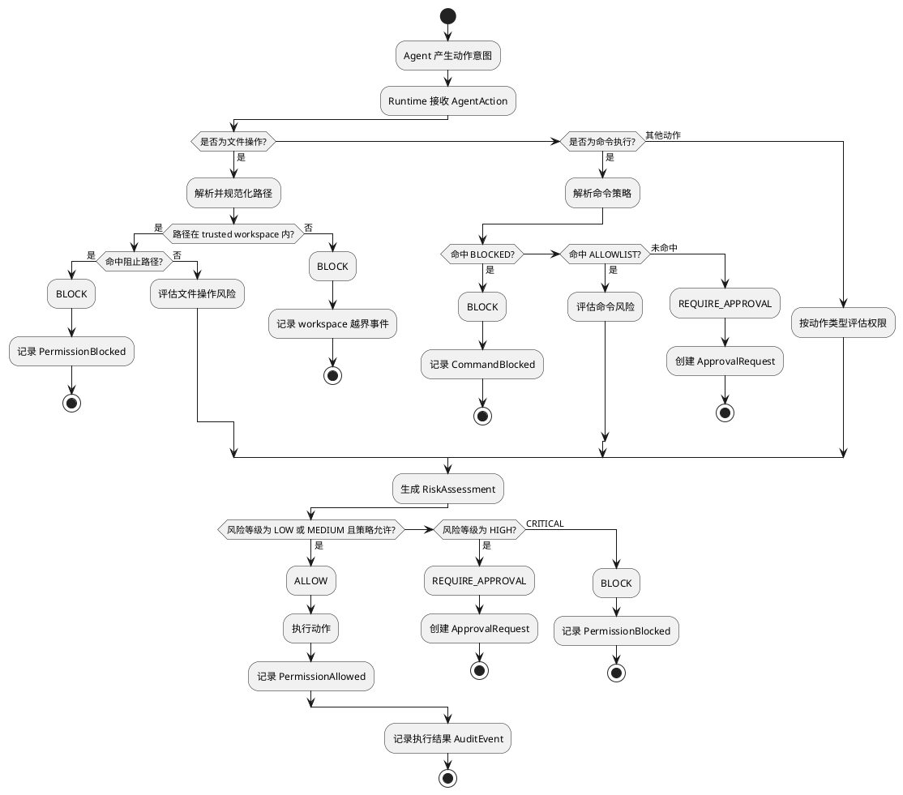

# 权限模型草案

## 1. 文档目标

本文档描述可审计编码智能体第一版的权限模型。该模型用于约束 Agent 在本地环境中的文件访问、命令执行、审批申请和审计记录。

第一版权限模型的核心目标是：

- Agent 只能操作用户信任的 Workspace
- Agent 默认可以读取、创建、修改 trusted workspace 内的普通文件
- Agent 默认不能访问 workspace 外路径
- Agent 默认不能自动执行命令
- 高风险操作必须经过用户审批
- 所有关键权限判断和审批结果必须进入审计日志

权限模型的核心原则：

> LLM 可以提出动作意图，但不能直接获得权限。是否允许执行动作，由 Runtime 根据权限策略、风险等级和用户审批结果决定。

## 2. 权限边界总览

第一版权限模型围绕以下对象展开：

```text
Workspace
PermissionPolicy
PermissionLevel
FileAccessRequest
CommandExecutionRequest
CommandPolicy
RiskAssessment
ApprovalRequest
AuditEvent
```

权限判断主线：

```text
AgentAction
→ Permission Check
→ Risk Assessment
→ Allow / Require Approval / Block
→ Execute or Wait
→ AuditEvent
```

## 3. Workspace 信任边界

`Workspace` 是 Agent 文件访问和命令执行的根边界。

第一版中，Agent 只能操作用户显式标记为 trusted 的 Workspace。

建议规则：

- 未注册的路径默认不可访问
- 未信任的 Workspace 默认不可访问
- 所有文件路径必须规范化后再判断边界
- 符号链接、相对路径、路径穿越都必须解析到真实路径后再判断
- Agent 默认不能访问 workspace 外路径；第一版中 workspace 外路径一律阻止，不进入普通审批流程
- Agent 默认不能修改 `.git` 目录
- Agent 默认不能读取或修改敏感文件，除非用户额外审批；密钥类、凭证类文件可以直接阻止

Workspace 建议字段：

```text
workspaceId
name
rootPath
trusted
allowedOperations
blockedPaths
sensitivePathPatterns
createdAt
lastUsedAt
```

## 4. 权限等级

建议将权限分为以下等级：

```text
READ_ONLY
WORKSPACE_WRITE
SHELL_SAFE
SHELL_RISKY
GIT_READ
GIT_WRITE
NETWORK
```

### 4.1 READ_ONLY

允许读取 trusted workspace 内的普通文件。

典型操作：

```text
list_files
read_file
search_text
git_status
git_diff
```

### 4.2 WORKSPACE_WRITE

允许在 trusted workspace 内创建和修改普通文件。

典型操作：

```text
create_file
apply_patch
write_file
```

需要注意：

- 删除文件不属于默认写权限
- 移动文件不属于默认写权限
- 修改敏感文件需要审批
- 大范围修改需要审批

### 4.3 SHELL_SAFE

允许执行用户白名单中的安全命令。

典型命令：

```text
mvn test
./mvnw test
gradle test
npm test
npm run test
pytest
go test ./...
cargo test
git status
git diff
```

### 4.4 SHELL_RISKY

表示可能产生副作用的命令执行能力。

典型命令：

```text
npm install
mvn package
docker compose up
git checkout
git merge
```

这类命令默认需要审批。

### 4.5 GIT_READ

允许读取 Git 状态。

典型操作：

```text
git status
git diff
git log
git show
```

### 4.6 GIT_WRITE

允许修改 Git 状态。

典型操作：

```text
git commit
git checkout
git merge
git rebase
git reset
```

第一版中，Git 写操作必须审批。破坏性 Git 操作应默认阻止。

### 4.7 NETWORK

允许访问外部网络。

典型操作：

```text
下载依赖
访问远程 API
拉取远程文档
调用外部服务
```

第一版中，网络访问默认需要审批。

## 5. 文件权限策略

建议将文件权限拆分为：

```text
FILE_READ
FILE_CREATE
FILE_MODIFY
FILE_DELETE
FILE_MOVE
```

第一版默认允许：

```text
FILE_READ
FILE_CREATE
FILE_MODIFY
```

前提条件：

- 文件位于 trusted workspace 内
- 文件不属于敏感文件
- 操作不是大范围修改
- 操作没有命中阻止路径

第一版默认需要审批：

```text
FILE_DELETE
FILE_MOVE
读取敏感文件
修改敏感文件
修改构建或依赖配置
大范围文件修改
单次 patch 行数过多
修改 workspace 权限配置
```

第一版默认阻止：

```text
访问 workspace 外路径
修改 .git 目录
路径穿越
写入系统目录
覆盖用户未授权目录文件
读取或修改密钥类、凭证类、私钥类文件
```

## 6. 敏感文件和高影响文件

### 6.1 敏感文件

敏感文件默认需要审批，必要时可以直接阻止。

统一规则：

```text
敏感文件读取：默认 REQUIRE_APPROVAL
敏感文件修改：默认 REQUIRE_APPROVAL
密钥类、凭证类、私钥类文件读取或修改：可以直接 BLOCK
审计日志中永远不保存敏感文件内容，只保存路径、原因、脱敏摘要
```

建议默认敏感文件：

```text
.env
.env.*
*.pem
*.key
id_rsa
id_ed25519
credentials
secrets
*.p12
*.jks
```

### 6.2 高影响文件

高影响文件可以允许修改，但应提高风险等级并进入审批。

建议默认高影响文件：

```text
pom.xml
build.gradle
settings.gradle
package.json
package-lock.json
pnpm-lock.yaml
yarn.lock
Dockerfile
docker-compose.yml
```

## 7. 命令权限策略

命令执行默认不自动允许。Runtime 应先根据命令策略分类，再决定是否执行。

命令策略分为：

```text
ALLOWLIST
APPROVAL_REQUIRED
BLOCKED
```

### 7.1 ALLOWLIST

用户明确加入白名单的命令，可以自动执行。

命令白名单不是字符串白名单，而是结构化规则。建议白名单命令必须同时匹配：

- executable：命令主程序
- argsPattern：参数结构
- cwdScope：工作目录范围
- allowPipe：是否允许管道
- allowRedirect：是否允许重定向
- allowBackground：是否允许后台运行
- envPolicy：环境变量继承和覆盖策略

第一版默认不允许管道、重定向、后台执行和内联脚本拼接。不建议只用字符串前缀判断命令安全性。

### 7.2 APPROVAL_REQUIRED

未加入白名单，但不属于明确危险的命令，应进入审批流程。

审批请求应展示：

```text
命令内容
工作目录
申请原因
风险等级
可能影响
是否访问网络
是否写入文件
是否长期运行
```

### 7.3 BLOCKED

明显危险的命令默认阻止。

建议默认阻止：

```text
rm -rf
del /s
format
chmod -R
curl | sh
远程脚本直接执行
删除 workspace 根目录
清空用户目录
修改系统目录
```

破坏性 Git 操作也建议默认阻止或要求非常明确的二次确认：

```text
git reset --hard
git clean -fd
git checkout .
```

## 8. 风险等级

建议定义统一风险等级：

```text
LOW
MEDIUM
HIGH
CRITICAL
```

### 8.1 LOW

低风险操作。

示例：

```text
读取普通文件
搜索代码
查看 git diff
查看 git status
修改单个普通源代码文件的小 patch
```

### 8.2 MEDIUM

中风险操作。

示例：

```text
创建新文件
修改多个普通文件
修改测试文件
执行白名单测试命令
```

### 8.3 HIGH

高风险操作。

示例：

```text
删除文件
移动文件
修改构建配置
修改依赖配置
执行未加入白名单的命令
安装依赖
启动服务
网络访问
Git 写操作
```

### 8.4 CRITICAL

严重风险操作。

示例：

```text
访问 workspace 外路径
修改系统目录
删除大量文件
执行远程脚本
破坏性 Git 操作
修改密钥或凭证文件
```

第一版可以对 CRITICAL 操作直接阻止，后续再考虑更严格的二次确认机制。

## 9. 审批模型

`ApprovalRequest` 是 Runtime 暂停执行并等待用户决策的控制点。

必须审批的行为：

```text
删除文件
移动或重命名文件
执行未加入白名单的命令
读取敏感文件
修改敏感文件
修改构建或依赖配置
大范围文件修改
安装依赖
网络访问
Git 写操作
启动长期运行进程
```

访问 workspace 外路径不进入普通审批流程。第一版应直接 `BLOCK`，如果用户确实需要访问新目录，应通过手动扩大 workspace 边界实现。

审批请求建议字段：

```text
approvalId
taskId
runId
stepId
actionId
approvalType
reason
riskLevel
affectedFiles
command
workingDirectory
patchPreview
status
createdAt
resolvedAt
```

审批状态：

```text
PENDING
APPROVED
DENIED
EXPIRED
CANCELLED
```

用户可选动作：

```text
允许本次操作
拒绝本次操作
将命令加入白名单
修改后再允许
终止任务
```

## 10. 权限决策结果

Runtime 对每个动作应给出明确决策结果：

```text
ALLOW
REQUIRE_APPROVAL
BLOCK
```

决策结果说明：

```text
ALLOW：动作可以直接执行
REQUIRE_APPROVAL：动作暂停，生成审批请求
BLOCK：动作不允许执行，记录原因
```

建议权限决策记录：

```text
decisionId
actionId
decision
reason
riskLevel
matchedPolicy
requiredApprovalType
createdAt
```

## 11. 审计要求

所有权限相关行为都必须进入审计日志。

必须记录的事件：

```text
PermissionChecked
PermissionAllowed
PermissionBlocked
ApprovalRequested
ApprovalGranted
ApprovalDenied
FileRead
FileCreated
FileModified
FileDeleted
CommandRequested
CommandExecuted
CommandBlocked
```

审计事件建议字段：

```text
eventId
taskId
runId
stepId
eventType
actor
timestamp
inputSummary
outputSummary
relatedFiles
permissionLevel
riskLevel
approvalStatus
errorMessage
metadata
```

## 12. PlantUML 类图



## 13. PlantUML 权限决策流程图



## 14. 第一版建议落地范围

第一版不需要实现完整复杂权限系统，建议优先实现：

```text
Workspace trusted 边界
文件路径规范化和越界拦截
文件读、创建、修改默认允许
文件删除、移动默认审批
敏感文件修改审批
命令白名单
白名单外命令审批
危险命令阻止
权限决策审计事件
审批请求和审批结果记录
```

暂时可以不做：

```text
团队角色权限
多用户审批
远程权限策略同步
复杂沙箱隔离
插件级权限市场
组织级策略继承
```

## 15. 第一版验收标准

权限模型第一版完成后，应满足：

- Agent 无法访问 workspace 外文件
- Agent 可以读取 trusted workspace 内普通文件
- Agent 可以创建和修改 trusted workspace 内普通文件
- Agent 删除文件时必须生成审批请求
- Agent 执行白名单外命令时必须生成审批请求
- Agent 执行危险命令时被阻止
- 所有权限判断、审批请求、审批结果都有审计事件
- 用户可以从任务报告中看到哪些动作被允许、拒绝或阻止
